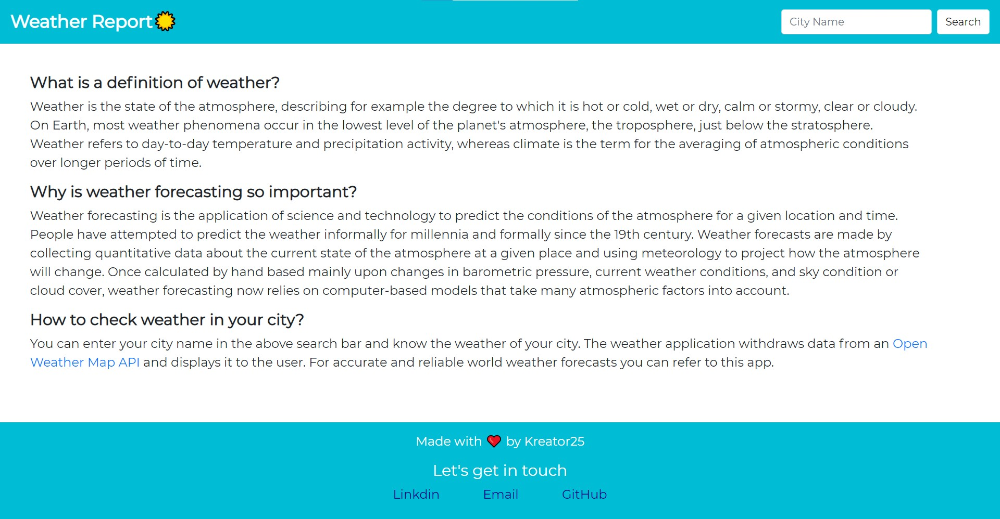
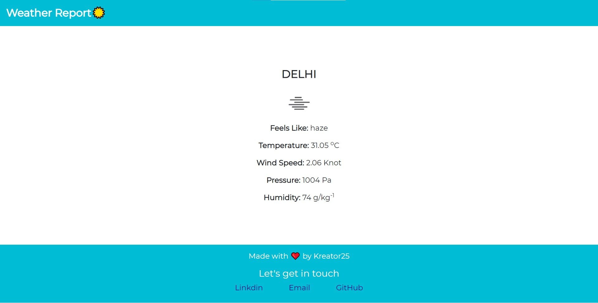

# Weather Application

This application helps us to see live weather forecasting of 
particular city. The weather application withdraws data from an 
Open Weather Map API and displays it to the user. For accurate 
and reliable world weather forecasts we can refer to this app.


## Screenshots

#### Home Page


#### Weather Data

  
## API Reference

#### Get data for a particular city.

```http
  GET https://api.openweathermap.org/data/2.5/weather?q=" + query + "&appid=" + apiKey + "&units=" + units
```

| Parameter | Type     | Description                |
| :-------- | :------- | :------------------------- |
| `query` | `string` | **Required**. City Name |
| `apiKey` | `string` | **Required**. Your API key |
| `units` | `string` | Units |


## Run Locally

Clone the project

```bash
  git clone https://github.com/Kushagra-Kapoor25/weatherApp.git
```

Go to the project directory

```bash
  cd weatherApp
```

Install dependencies

```bash
  npm install
```

Start the server

```bash
  npm run app
```

  

## Feedback
If you have any feedback, please reach me out at kushagrakapoor27@gmail.com.

## Authors
- [@Kushagra-Kapoor25](https://github.com/Kushagra-Kapoor25)

  

  
